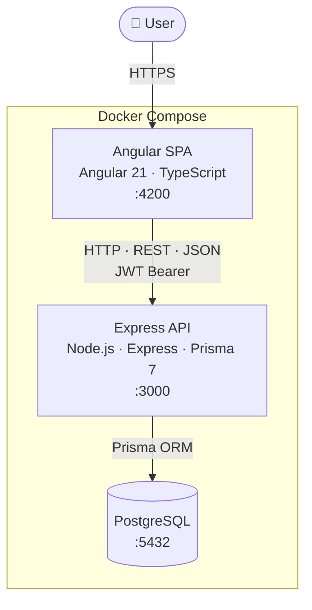

# Vouchus — Product Review System

A full-stack product review platform built as a showcase project with extensibility and maintainability as primary goals.

**Stack:** Angular 21 · Node.js/Express · PostgreSQL · Prisma 7 · Docker

---

## Features

- User registration and JWT authentication
- Product listing with pagination and average rating
- Purchase flow — users must buy a product before reviewing it
- Reviews with star rating, body, pros and cons
- Review editing and deletion (own reviews only)
- `avgRating` on each product kept in sync via Prisma transactions

---

## Architecture



---

## Prerequisites

- Node.js 22+
- Docker (for PostgreSQL)

---

## Setup

### 1. Clone and install dependencies

```sh
git clone ...
npm run install:all   # installs root, backend, and frontend deps; also generates Prisma client
```

### 2. Configure environment

```sh
cp .env.example .env          # Docker Compose variables
cp backend/.env.example backend/.env  # backend app variables
```

Edit both files — at minimum set a strong `JWT_SECRET`.

### 3. Start the database and app

```sh
docker-compose up -d    # starts PostgreSQL + backend + frontend
```

The backend runs migrations automatically on startup via `entrypoint.sh`.

- **Frontend** → http://localhost:4200
- **Backend** → http://localhost:3000

---

## Local Development (without Docker)

If you want hot-reload during development you can run the backend and frontend directly. You still need a running PostgreSQL instance — the Docker Compose stack exposes it on `localhost:5432`, so `docker-compose up -d db` is the easiest way to get one.

### 1. Start only the database

```sh
docker-compose up -d db
```

### 2. Run migrations

```sh
cd backend && npx prisma migrate deploy
```

### 3. Start both servers

```sh
npm run dev          # from repo root — runs backend and frontend concurrently
```

Or start them individually:

```sh
cd backend && npm run dev    # http://localhost:3000
cd frontend && npm run dev   # http://localhost:4200 (separate terminal)
```

Both use nodemon/Angular dev server with watch mode, so changes reload automatically.

### 4. Seed sample data (optional)

```sh
cd backend && npm run db:seed
```

---

## Production Checklist

make sure to:

- **Set a strong `JWT_SECRET`** — never use the development default
- **Set `NODE_ENV=production`** — enables Express production mode
- **Point `DATABASE_URL` at a managed PostgreSQL instance** — not the dev container
- **Run migrations as part of release**: `npx prisma migrate deploy` (the Docker entrypoint already does this; replicate it in your deploy pipeline)
- **Build the frontend**: `npm run build --prefix frontend` — serve the output from `frontend/dist/` via a static host or a reverse proxy in front of the backend
- **Restrict `CORS_ORIGIN`** to your actual frontend domain

---

## Running Tests

### Start the test database

Tests connect to a separate `vouchus_test` database. The dev Docker Compose already exposes PostgreSQL on port 5432, so just make sure the stack is running:

```sh
docker-compose up -d db
```

### Backend

```sh
cd backend && npm test
```

On first run, Vitest's global setup creates `vouchus_test`, runs all migrations against it, then tests begin. Each test truncates all tables for isolation. Subsequent runs skip DB creation and pending migrations.

### Frontend

```sh
cd frontend && npm test
```

Pure unit tests using Angular's `HttpTestingController` — no database required.

---

## API

| Method | Endpoint | Auth | Description |
|--------|----------|------|-------------|
| POST | `/api/auth/register` | — | Register |
| POST | `/api/auth/login` | — | Login |
| GET | `/api/auth/me` | JWT | Current user |
| GET | `/api/products` | — | List products (`?page&limit`) |
| GET | `/api/products/:id` | Optional JWT | Product detail + reviews + `hasPurchased` |
| POST | `/api/products/:id/orders` | JWT | Purchase a product |
| GET | `/api/products/:id/reviews` | — | Paginated reviews |
| POST | `/api/products/:id/reviews` | JWT | Submit review |
| PATCH | `/api/products/:id/reviews/:reviewId` | JWT | Edit own review |
| DELETE | `/api/products/:id/reviews/:reviewId` | JWT | Delete own review |

---

## Project Structure

```
vouchus/
├── .github/workflows/ci.yml  # GitHub Actions — backend + frontend jobs in parallel
├── backend/
│   ├── prisma/               # schema.prisma + migrations + seed
│   ├── src/
│   │   ├── app.ts            # Express app (no listen — imported by tests)
│   │   ├── index.ts          # entry point (loads .env, calls app.listen)
│   │   ├── config.ts         # env var validation
│   │   ├── middleware/       # authenticate, optionalAuthenticate, errorHandler
│   │   ├── routes/
│   │   ├── controllers/
│   │   ├── services/
│   │   ├── validators/       # Zod schemas
│   │   └── constants/        # REVIEW_CONSTANTS (rating range, body/pros/cons limits)
│   └── tests/
│       ├── setup/            # global-setup.ts (DB creation + migrations), setup.ts (truncate)
│       ├── helpers/          # createUser, createProduct, createOrder, createReview, authHeader
│       └── routes/           # integration tests for all routes
└── frontend/
    └── src/app/
        ├── core/             # services, JWT interceptor, auth guard
        ├── models/
        ├── pages/            # auth, products, reviews
        └── shared/           # navbar, star-rating component
```

---

## Design Decisions & Trade-offs

### Order model over a simple join table
A dedicated `Order` model with `priceAtPurchase` captures the product price at transaction time. A user can order the same product multiple times (no unique constraint on `userId + productId`). A review is allowed if at least one order exists. This reflects how real purchase systems work rather than a simplified "purchased" boolean.

### `avgRating` stored on Product
Average rating is denormalized onto the `Product` row and updated inside a Prisma transaction whenever a review is created, updated, or deleted. This trades a small write overhead for fast reads — no aggregation query needed when listing products.

### TOCTOU avoided in review creation
There are no pre-flight existence or duplicate checks before the transaction. Instead, the transaction relies on the DB unique constraint (`@@unique([userId, productId])`) and catches Prisma error codes `P2002` (duplicate) and `P2003` (missing FK) to return the correct HTTP status. This eliminates a race condition class entirely.

### `optionalAuthenticate` middleware
The `GET /api/products/:id` endpoint is public but returns `hasPurchased: true/false` for logged-in users. A dedicated `optionalAuthenticate` middleware attaches `req.user` if a valid token is present and silently continues without it. This avoids duplicating the route or forking logic inside the controller.

### `app.ts` separated from `index.ts`
Standard practice for testable Express apps. `app.ts` exports the configured Express app without calling `listen`. `index.ts` is the entry point that loads `.env` and starts the server. Tests import `app.ts` directly — if `listen` were called at import time, every test file would bind a port and load `.env` as a side effect.

### Real PostgreSQL for backend tests
Backend tests run against a real `vouchus_test` PostgreSQL database rather than mocks or an in-memory store. This means tests catch constraint violations, transaction behaviour, and query correctness that mocked DB calls would miss. The trade-off is needing a running PostgreSQL instance, solved by the Docker Compose dev stack.

### Prisma 7 `prisma-client` provider
This project uses Prisma 7's new `prisma-client` provider (Rust-based) with a custom `output` directory. Unlike the traditional `prisma-client-js`, `@prisma/client` does not re-export error classes in this configuration — they must be imported from the generated path. All Prisma imports in `src/` and `tests/` therefore use `../../generated/prisma/client/client.js` rather than `@prisma/client`.

### Monolith over microservices
Everything — auth, products, orders, reviews — runs in one application connected to one database. That's the right fit here because the features are deeply connected. A review requires an order to exist, and creating a review updates the product's rating — all in one database transaction. Splitting these into separate services would trade that simplicity for significant infrastructure complexity with no real benefit at this scale. Microservices make sense when different parts of a system need to scale independently or when separate teams own separate parts. Neither applies here.

### Limits enforced at both layers
Review field limits (`REVIEW_CONSTANTS`) are defined once in `backend/src/constants/` and mirrored in `frontend/src/app/constants/`. The backend Zod schema is the authoritative enforcement; the frontend uses the same values to drive UI validation and character counters. Keeping them in sync is a manual step — a shared package would be the next evolution.

---
## Personal notes

Claude Code generated a lot of the code. Originally I wanted to use an agentic workflow (Claude Code plugin) 
that I have been experimenting with (https://github.com/Kazarr/claude-code-agentic-workflow-new), but I decided for 
more hands on approach. The reason for this is Prisma. This is my first experience with Prisma, and I wanted to take 
this as a learning experience, more hands-on approach allowed me to learn more about Prisma and how it works.

I considered adding RabbitMQ for async email notifications (e.g. welcome emails on registration), but kept it out of 
scope. At this scale it would be over-engineering. The monolith handles everything cleanly without it. The more 
interesting question is when it would make sense to introduce it, which is worth more in a discussion than a bolted-on 
implementation.

